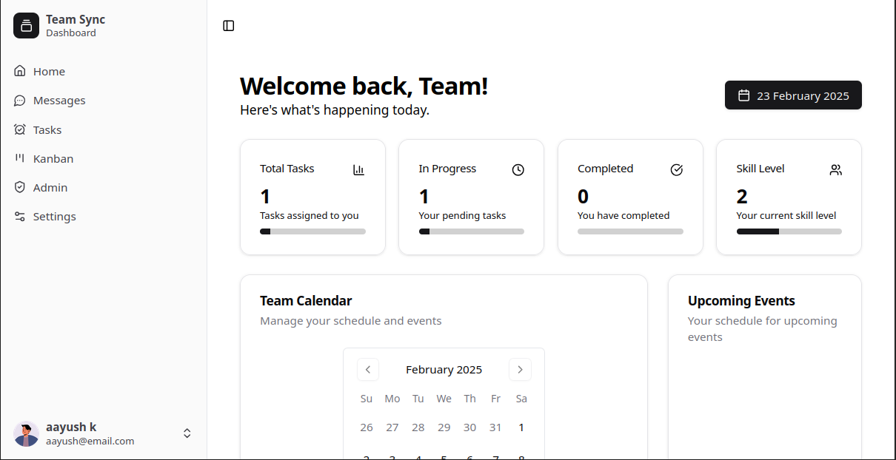
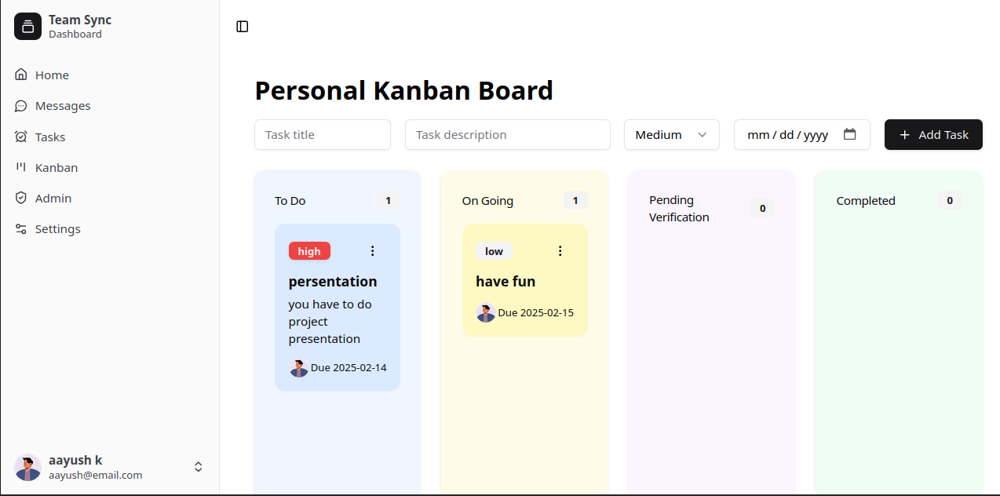
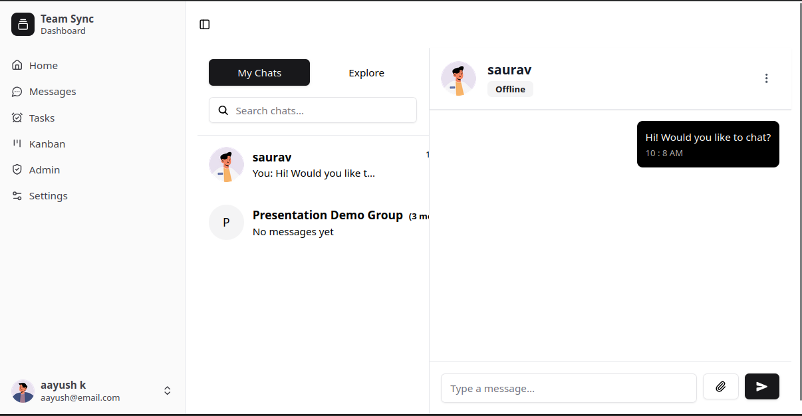
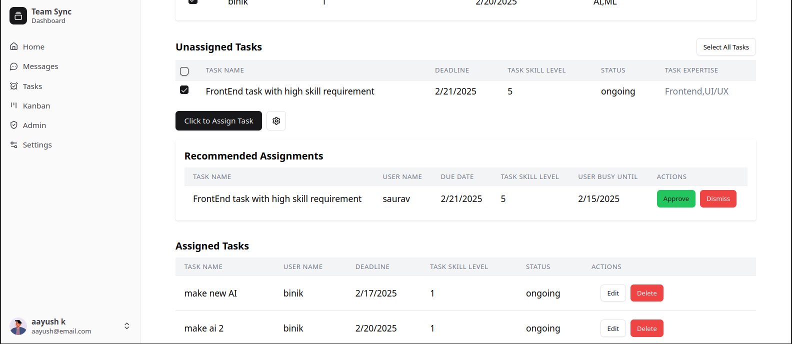

# TeamSync
Team Communication and Task Management Platform

## About
This project is a full-stack web application built using Node.js, Express.js, and React. It provides a seamless experience for users by leveraging a RESTful API on the backend and a dynamic frontend.

## Features

- User authentication (Login/Signup)
- RESTful API with Express.js
- React frontend with state management
- Database integration with PostgreSQL
- API error handling and validation

## Tech Stack

- Frontend: React, Vite, Tailwind CSS, Shadcn
- Backend: Node.js, Express.js
- Database: PostgreSQL

## Requirements
- PostgreSQL
- Node
- NPM

## Setup

1. Create your PostgreSql database
2. Setup your database config into `backend/src/config/database.js`
3. initialize database with `npm run initdb`
4. start backend `npm run start`
5. start frontend
  ```
  cd frontend
  npm run dev
  ```

## Screenshots

### Dashboard


### Kanban


### Chat


### Task Assignment

